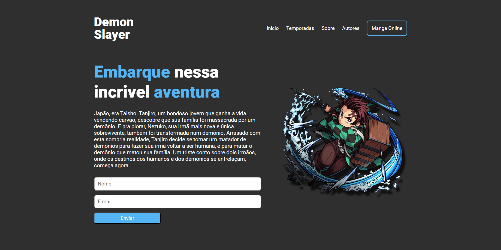

# Demon Slayer - Site Temático em HTML5 e CSS3

[](https://github.com/lucasdlima11/demon-slayer)
[](https://opensource.org/licenses/MIT)

Este é um repositório que contém um site temático de Demon Slayer, um anime japonês popular. O site foi desenvolvido utilizando apenas HTML5 e CSS3, sem a necessidade de frameworks adicionais.



## Tecnologias Utilizadas
Neste projeto, as seguintes tecnologias foram utilizadas:

- HTML5: Linguagem de marcação utilizada para estruturar o conteúdo do site.
- CSS3: Linguagem de estilo utilizada para estilizar e dar aparência visual ao site.

## Clonando o Repositório
Siga os passos abaixo para clonar este repositório em sua máquina local:

1. Abra o terminal ou prompt de comando.
2. Navegue até o diretório onde deseja clonar o repositório.
3. Execute o seguinte comando para clonar o repositório:

```bash
git clone https://github.com/lucasdlima11/demon-slayer.git
```

4. Após o término do comando, o repositório será clonado em seu diretório local.

Agora você possui uma cópia local do repositório!

## Contribuindo
Se você deseja contribuir para este projeto, siga as etapas abaixo:

1. Faça um fork deste repositório.
2. Crie uma nova branch com sua contribuição: 
```bash
git checkout -b minha-contribuicao
```
3. Faça as alterações desejadas no código.
4. Realize o commit das suas alterações: 
```bash
git commit -m "Minha contribuição"
```
5. Faça o push da branch para o seu fork:
```bash
git push origin minha-contribuicao
```
6. Abra um pull request no repositório original para que suas alterações sejam revisadas e incorporadas ao projeto.

## Licença
Este projeto está licenciado sob a Licença MIT. Consulte o arquivo [LICENSE](LICENSE) para obter mais informações.

---

Esperamos que você aproveite este projeto temático de Demon Slayer! Se tiver alguma dúvida, não hesite em entrar em contato.